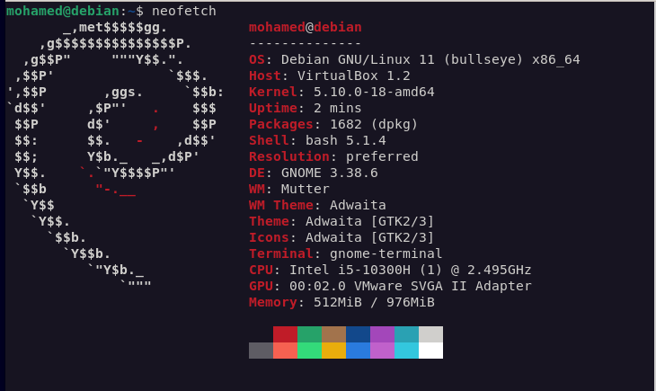

# Mini-Projet : utilitaire d'archive

## **Guide d'installation & d'utilisation**

 

## Démarche & choix retenus

- Machine virtuel : Linux Debian 11 (bullseye)
- Language : Python3 et Bash
- Serveur web : Apache
- Méthode de transfert : SFTP ave openSSH
- Automatisation : Cron
- Méthode email : SMTPS avec gmail
- Fichier de configuration : format json (pour la lisibilité)

## Tâches restantes :

- Compression en .zip
- Fichier de log
- Correctifs
- Documentation utilisateur d'installation
- Mémoire technique

## Prérequis :

- Exécuter en _sudo_ le fichier _dependances.sh_
- Des adresses IP statiques
- Il faut se connecter manuellement en SFTP la première fois avec la machine

## Crontab :

**Arguments possibles pour le champs _période_ crontab**

- reboot
- yearly
- annually
- monthly
- weekly
- daily
- midnight
- hourly
